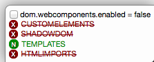

# Danger Dashboard
> A Firefox add-on

You've been messing with `about:config` and `dom.webcomponents.enabled` but you don't remember it anymore. Suddenly you visit a website that uses Web Components and nothing works the way you expect it-you need HELP!

This add-on renders a little dashboard on the bottom right corner on each page load, displaying the available support for each of the four APIs that are used to build Web Components: Custom elements, Shadow DOM, HTML templates and HTML Imports:

## Using

The add-on will run and detect features on each page load. When features are available natively, they will have a little 'N' to their left. Polyfilled features will have a 'P'. Finally, unavailable features will have an 'X'.

You can toggle the `dom.webcomponents.enabled` Firefox preference by clicking the checkbox on the dashboard. You will need to manually reload the page for the page and the dashboard to pick the new values.

## Configuring

Currently there is nothing that can be configured.

## Contributing

I am not an expert on writing Firefox add-ons---in fact, this is *the first add-on* I ever write. So there *will* be rough edges here, for which I apologise.

You can help to make it better by using it and [reporting errors and weirdnesses](https://github.com/sole/danger-dashboard/issues/new), and you can make it better *faster* by contributing code that fixes [existing issues](https://github.com/sole/danger-dashboard/issues).

If you want to help fix an specific issue but are not entirely familiar with code, that's OK too! Add a comment to the issue you're interested in, and we'll take it from there.

Here are some notes on how to run a development copy and how the code is structured:

### Running a development copy

This add-on is built using the cfx tool, which is an SDK for helping you write Firefox Add-ons with less boilerplate. There is [a lot of info over at MDN](https://developer.mozilla.org/Add-ons/SDK), but if you're running a Mac and have Homebrew installed, you can get `cfx` installed with just `brew install mozilla-addon-sdk`.

Then check out this repository, cd to its directory and run `cfx run` from a terminal to get a Firefox instance loaded with a new profile that has the local copy of the add-on installed, so you can test it without any other addons interfering with this one.

You will need to type in a URL for the browser to navigate somewhere and the add-on to start. I have no idea if there is a way to tell the `cfx` tool to navigate to a URL upon start (it would be *SO COOL*, it's even [an existing official issue](https://github.com/sole/danger-dashboard/issues/4)).

### Code walkthrough

The add-on is composed of two parts, the `lib/main.js` which is the code that gets run first but has no access to the DOM of the pages you visit in the browser. So we need to load `data/overlay.js` which is the part that actually has access to each page that you load, and can inspect the `window` object. BUT we do it via the `unsafeWindow` object, because if we used just `window` we would just be accessing the addon's context `window` object, which is not the same that the page runs in (and hence we would be unable to detect if any polyfill has patched the `document` object to provide `registerElement`, for example.

Communication between `main.js` and `overlay.js` is done via message passing through `ports`. If you have used something like Socket.io it's pretty similar.

We also include another library I wrote, [WebComponentsSupport](https://github.com/sole/WebComponentsSupport) which runs a series of tests to figure out which features are available.

### Packaging

Once you're happy with the code you just need to run `cfx xpi` to generate an xpi file that can be uploaded to addons.mozilla.org---or you can use it to install the add-on on other Firefox versions, or to distribute it from your own server even!

You don't need to worry about uploading anything to addons.mozilla.org---I take care of that.

## License

© 2014 Soledad Penadés, licensed under the Apache 2.0 License.
